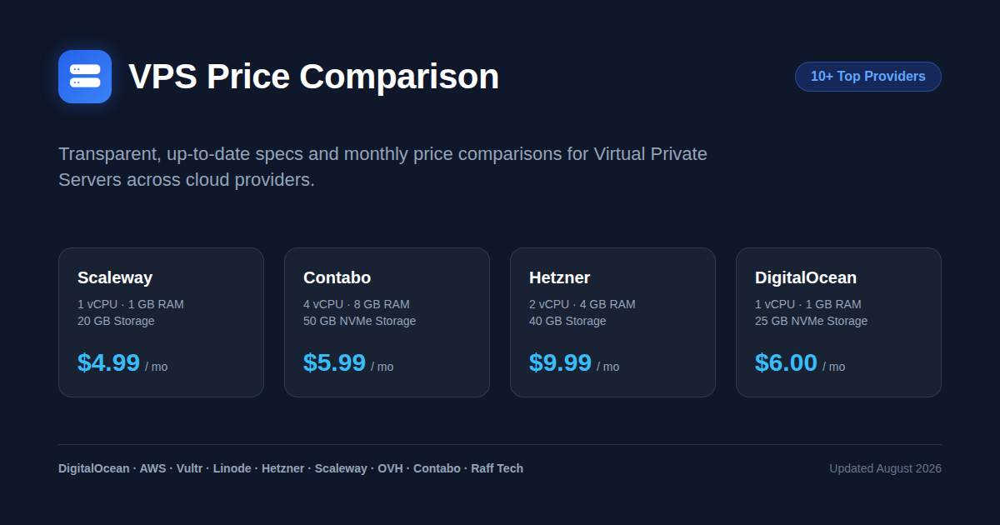

# VPS Prices

A simple, interactive dashboard for comparing Virtual Private Server (VPS) prices, hardware specs (CPU, Memory, Disk), and price-to-performance across major cloud infrastructure providers.

Live Web Application: [https://lesichkovm.github.io/vps-prices/](https://lesichkovm.github.io/vps-prices/)

## Goal

The primary goal of this repository is to collect, normalize, and present up-to-date pricing and technical specifications for Virtual Private Servers across top cloud hosting providers.

Choosing a VPS can be overwhelming due to varying specs, tier structures, and pricing models. This project provides a centralized, searchable, and filterable table allowing developers, sysadmins, and organizations to quickly identify the best VPS plan for their workload and budget.

### Currency Standardization

To allow a fair, apples-to-apples comparison across all providers, all prices originally quoted in Euros (EUR) or British Pounds (GBP) are converted to US Dollars (USD). The exchange rates used are:

- **1 EUR = 1.16 USD**
- **1 GBP = 1.37 USD**

## Researched Providers

Below is the list of VPS hosting providers included in our comparison along with links to their official websites:

- [AWS Lightsail](https://aws.amazon.com/lightsail/)
- [CloudFanatic](https://cloudfanatic.net/)
- [Contabo](https://contabo.com/)
- [DigitalOcean](https://www.digitalocean.com/)
- [eVPS](https://www.evps.net/packages)
- [Hetzner](https://www.hetzner.com/)
- [Linode (Akamai)](https://www.linode.com/)
- [OVHcloud](https://www.ovhcloud.com/)
- [Raff Technologies](https://rafftechnologies.com/)
- [Scaleway](https://www.scaleway.com/)
- [Vultr](https://www.vultr.com/)

Detailed research notes and data sources are maintained in the [`research/`](research/) directory.

## Project Structure

- `index.html`: Interactive Bootstrap Table interface with price tier filtering and search capabilities.
- `data.json`: Structured database containing VPS provider plans, CPU cores, RAM, storage size, and monthly pricing in USD.
- `research/`: Markdown records documenting verification dates, pricing tables, and links for each provider.

## License

MIT
